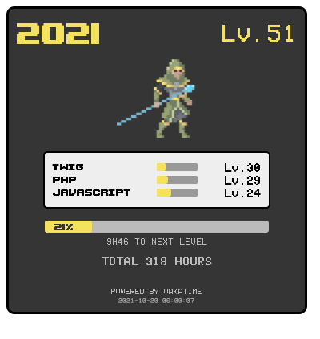

# What it is ?

Use the Wakatime API to create a "RPG like" badge of your coding activity

# Install

- Create a config.php from config.php.sample
- Configure a web server and call badge.php to get the badge

# Get a badge as a png

You can use 

